<p align="center">
  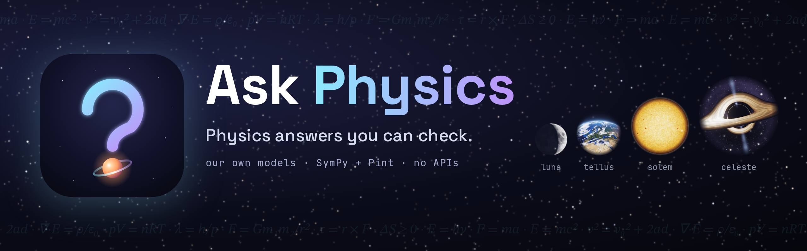
</p>

<p align="center">
  <a href="https://github.com/shankar-sachin/ask-physics/actions/workflows/ci.yml"></a>
  <a href="https://www.python.org/downloads/"></a>
  <a href="LICENSE"></a>
  <a href="CHANGELOG.md"></a>
  <a href="https://github.com/astral-sh/ruff"></a>
  <a href="https://mypy-lang.org/"></a>
  <a href="docs/ROADMAP.md"></a>
</p>

Ask any physics question, from a textbook problem to "how many rubber ducks
would it take to stop a freight train?", and get an answer you can check: the
equations it used (with ids and sources), every assumption spelled out, units
verified end to end, and an honest confidence score. Both halves are built here, run on your
machine, and call no external APIs:

- **The Fermi models**, our own language models trained from scratch:
  `fermi-tellus-1` (~3M params), `fermi-solem-1` (~30M), and
  `fermi-celeste-1` (~120M). They read the question, pick the right
  equations, copy the values, and write the explanation. They never do math.
- **The symbolic algebra machine**, built on SymPy and Pint, which solves the
  equations and checks every unit.

## Meet the Fermi models

<table>
  <tr>
    <td width="50%">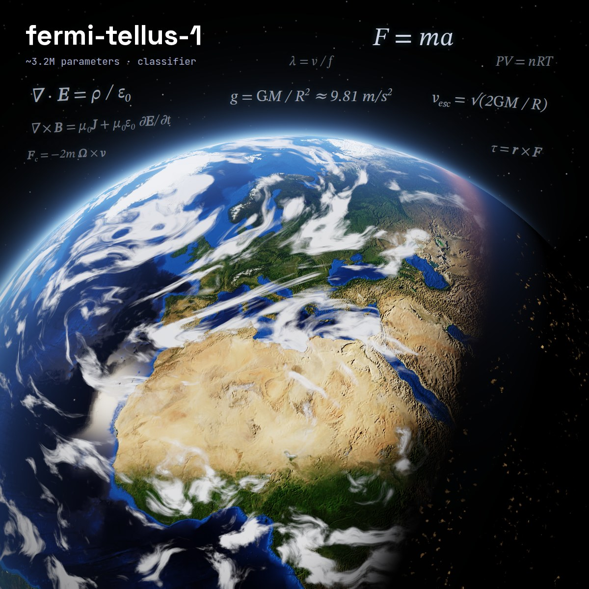</td>
    <td width="50%">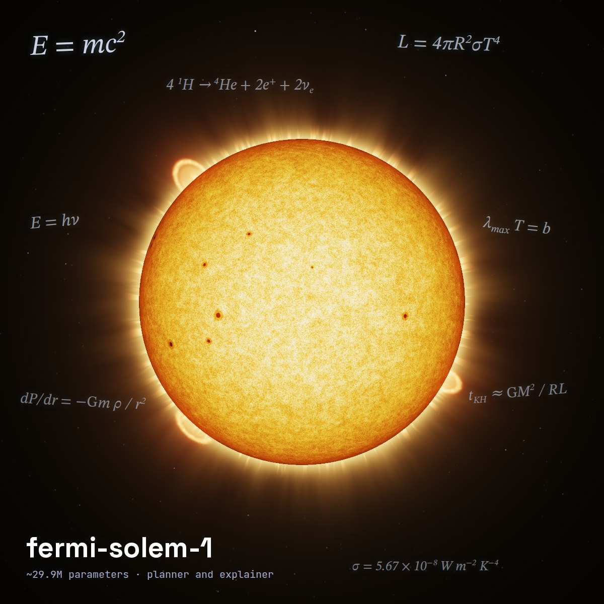</td>
  </tr>
  <tr>
    <td align="center"><b>fermi-tellus-1</b> · ~3.2M params<br>reads every question</td>
    <td align="center"><b>fermi-solem-1</b> · ~29.9M params<br>plans the solution, explains the answer</td>
  </tr>
  <tr>
    <td width="50%">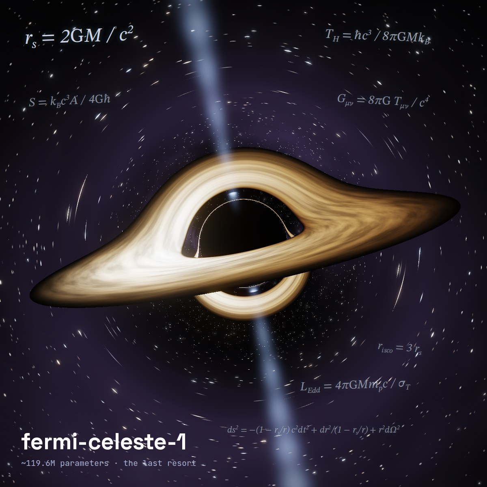</td>
    <td width="50%">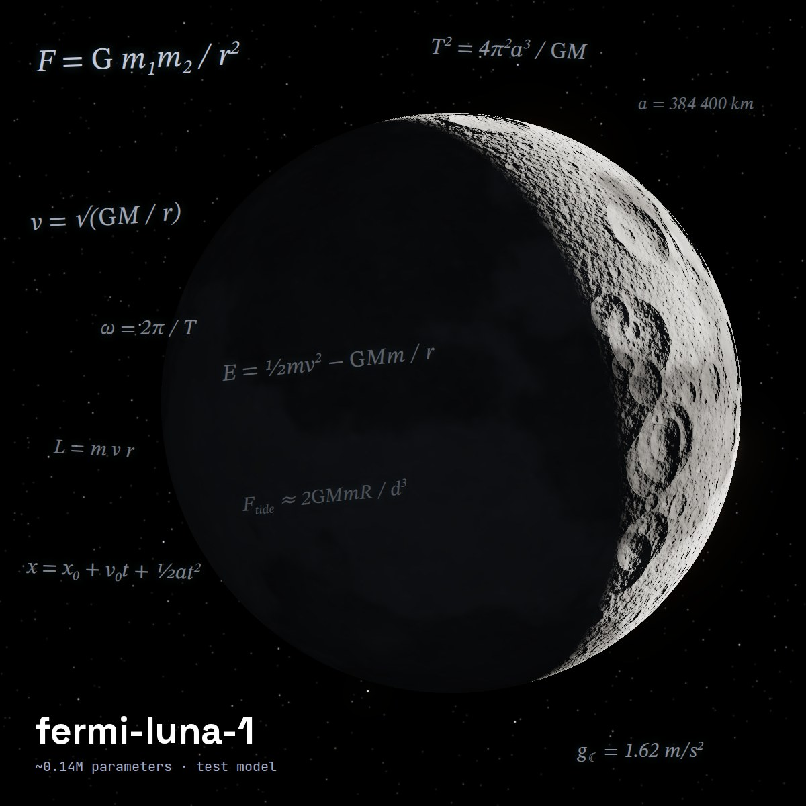</td>
  </tr>
  <tr>
    <td align="center"><b>fermi-celeste-1</b> · ~119.6M params<br>the last resort when solem gets stuck</td>
    <td align="center"><b>fermi-luna-1</b> · ~0.14M params<br>runs the test suite, never ships</td>
  </tr>
</table>

The artwork is rendered, not drawn: `make brand` runs
[`scripts/brand.py`](scripts/brand.py), which ray-traces the black hole
through Schwarzschild geodesics and lights the Moon, Earth, and Sun with
numpy. Earth imagery: NASA Blue Marble Next Generation and NOAA ETOPO1
(public domain). Moon map: [Solar System Scope](https://www.solarsystemscope.com/textures/),
from NASA LRO data ([CC BY 4.0](https://creativecommons.org/licenses/by/4.0/)).
More in [`docs/MODELS.md`](docs/MODELS.md).

## Screenshots

<p align="center">
  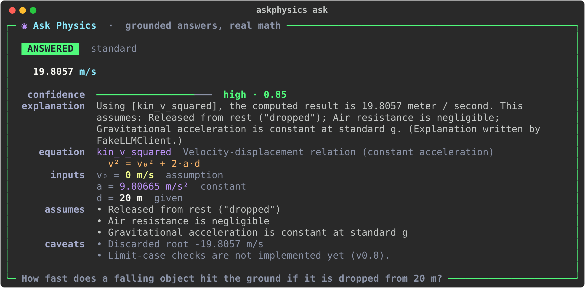
</p>

<p align="center">
  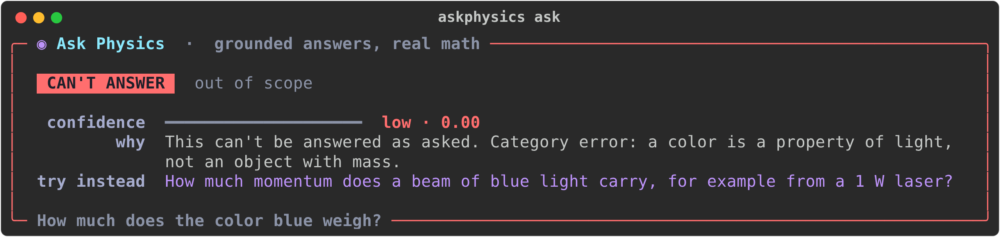
  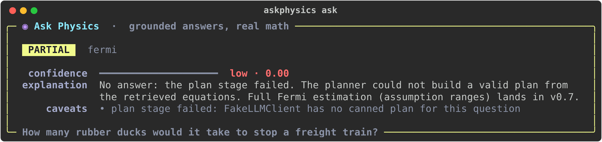
</p>

<p align="center">
  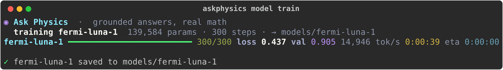
</p>

<p align="center">
  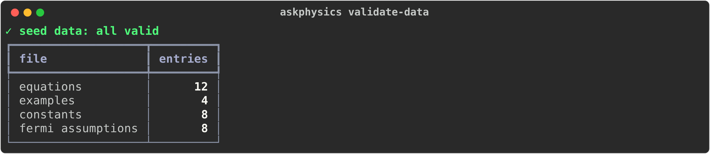
  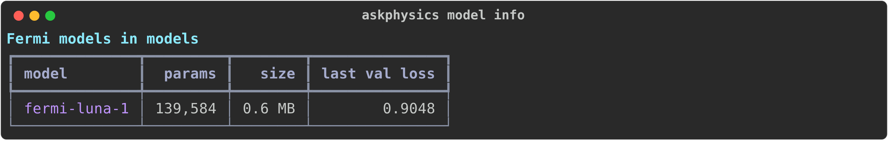
</p>

Every screenshot is real CLI output, regenerated with `make screenshots`.

## Install

**macOS and Linux**

```bash
curl -LsSf https://raw.githubusercontent.com/shankar-sachin/ask-physics/main/install.sh | sh
```

**Windows** (PowerShell)

```powershell
irm https://raw.githubusercontent.com/shankar-sachin/ask-physics/main/install.ps1 | iex
```

**Homebrew** (macOS and Linux)

```bash
brew install shankar-sachin/tap/askphysics
```

The scripts install `askphysics` into its own isolated environment with
[uv](https://docs.astral.sh/uv/), installing uv first if needed; they never
touch your system Python. Pin a version with `ASKPHYSICS_REF=v0.2.0`.
Uninstall with `uv tool uninstall askphysics` (or `brew uninstall askphysics`).
No API keys, no accounts: everything runs on your machine.

## How it works

```
                 "How fast does a falling object hit the ground if dropped from 20 m?"
                                              |
                                              v
  +-----------+   +-----------+   +--------+   +-----------+   +--------------+   +---------+
  | 1 classify|-->| 2 retrieve|-->| 3 plan |-->| 4 compute |-->| 5 sanity     |-->| 6 explain|
  |  (tellus) |   | equation  |   |(solem:|   | symbolic  |   |   check      |   |(solem:  |
  | standard/ |   | database  |   | ids +  |   | algebra   |   | units, order |   |  prose   |
  | fermi/    |   | search    |   | values |   | machine:  |   | of magnitude |   |  only)   |
  | nonsense  |   |           |   | only)  |   | SymPy+Pint|   |              |   |          |
  +-----------+   +-----------+   +--------+   +-----------+   +--------------+   +---------+
                                                                                        |
                        19.8057 m/s  [kin_v_squared]  confidence: high (0.85)  <--------+
                        assumptions: released from rest, no air resistance, standard g
```

The planner can only cite equations that retrieval actually found, and it
copies numbers and units out of the question without computing anything.
Constrained decoding makes anything else impossible, not just unlikely. If
solem can't produce a valid plan, celeste gets one shot (ADR-010). The
machine does the algebra, and Pint rejects any calculation whose units don't
add up. Confidence comes from a documented formula, never from the LLM grading
itself. Full details: [`docs/ARCHITECTURE.md`](docs/ARCHITECTURE.md).

## Quickstart

Requires Python 3.11 or newer. No API keys, ever. Until the Fermi models are
trained (v0.3), the default language model is a deterministic fake.

```bash
git clone https://github.com/shankar-sachin/ask-physics.git
cd ask-physics
python -m venv .venv && source .venv/bin/activate
make install            # pip install -e ".[dev]"

make test               # pytest with coverage
make lint typecheck     # ruff + mypy --strict

askphysics version
askphysics validate-data
askphysics ask "How fast does a falling object hit the ground if it is dropped from 20 m?"
askphysics ask --json "A rock is dropped from 45 meters. How fast does it land?"
askphysics ask "How much does the color blue weigh?"     # refused, with a redirect
```

Train a Fermi model yourself (the tiny `fermi-luna-1` takes a minute on CPU;
`fermi-solem-1` wants the GPU in an Apple Silicon Mac or similar):

```bash
askphysics model build-data --examples 20000 --workers 4
askphysics model train-tokenizer --vocab-size 512
askphysics model train --model fermi-luna-1 --steps 1000
askphysics model info
```

`FakeLLMClient` only has a canned plan for "dropped from a height" questions,
on purpose. Ask it anything else and the pipeline tells you exactly which
stage it couldn't complete, instead of making something up. The Fermi models
take over in v0.3.

## Project status: v0.2 released, v0.3 next

| Area | Status |
|------|--------|
| Six-stage pipeline with graceful degradation | Works |
| Symbolic algebra machine: single-equation solve with units (SymPy + Pint) | Works |
| Dimensional consistency and order-of-magnitude sanity checks | Works |
| Keyword retrieval over the equation database | Works |
| Seed data with full validation: 12 equations, 4 examples, 8 constants, 8 Fermi assumptions | Works |
| CLI: `ask`, `version`, `validate-data`, `model build-data / train-tokenizer / train / info` | Works |
| Confidence scoring (crude, documented formula) | Works |
| Eval set (8 questions) with a validating loader | Works |
| Fermi models: tokenizer, transformer, constrained decoding, data factory, training | Works |
| Fermi models trained and answering in the CLI | v0.3 |
| Multi-equation chaining | Stub until v0.4 |
| Eval scoring and runner | Stub until v0.5 |
| Vector and hybrid retrieval | Stub until v0.6 |
| Fermi range propagation | Stub until v0.7 |
| Limit-case checks | Stub until v0.8 |

Every stub raises `NotImplementedError` with a TODO describing the intended
implementation.

## Roadmap

v0.2 Fermi model foundations, v0.3 Fermi models trained and wired in, v0.4
solver expansion, v0.5 eval harness, v0.6 retrieval and data expansion, v0.7
Fermi engine, v0.8 self-verification, v0.9 hardening, v1.0 release. After
v1.0 comes a website. Until then the CLI is
the interface. Details, deliverables, and exit criteria are in
[`docs/ROADMAP.md`](docs/ROADMAP.md); the near-term backlog is
[`TODO.md`](TODO.md).

## Documentation

- [`PLAN.md`](PLAN.md): vision, pipeline, Fermi and refusal policies, confidence model
- [`docs/MODELS.md`](docs/MODELS.md): the Fermi model family, its architecture, data, training, and routing
- [`docs/ARCHITECTURE.md`](docs/ARCHITECTURE.md): modules, interfaces, one question traced through every stage
- [`docs/DATA_SCHEMA.md`](docs/DATA_SCHEMA.md) and [`docs/DATA_SOURCING.md`](docs/DATA_SOURCING.md): what data looks like and where it comes from
- [`docs/EVALS.md`](docs/EVALS.md): how answers are graded
- [`docs/DECISIONS.md`](docs/DECISIONS.md), [`docs/RISKS.md`](docs/RISKS.md), [`docs/OPEN_QUESTIONS.md`](docs/OPEN_QUESTIONS.md)
- [`docs/RELEASING.md`](docs/RELEASING.md): how a release is tagged and the Homebrew tap bumped

## Contributing

Read [`CONTRIBUTING.md`](CONTRIBUTING.md) first. The short version: the LLM
never does arithmetic, every number has units, every equation has a source
and a license, and data never enters the database without passing
`askphysics validate-data`. Security reports go through
[`SECURITY.md`](SECURITY.md). Participation is covered by the
[`CODE_OF_CONDUCT.md`](CODE_OF_CONDUCT.md).

## Limitations

Being straight about what this is right now:

- **It answers almost nothing yet.** With the fake LLM, only "dropped from a
  height" questions get a number. That is the point of a skeleton.
- **The equation database is tiny.** Twelve equations cover a slice of intro
  mechanics, E&M, and thermodynamics. Anything else hits a retrieval miss.
- **Keyword retrieval is brittle.** Phrasing that shares no words with an
  equation's tags won't find it. Vector search arrives in v0.6.
- **Single equations only.** Problems that chain two or more equations
  degrade until v0.4.
- **The Fermi models will be small.** Trained from scratch at 3M to 120M
  parameters, they'll understand phrasings close to their training data and
  stumble on weird ones. When they stumble, the answer degrades. It never
  makes shit up.
- **Scalars only.** No vectors, no Celsius, no numerical-only solutions yet
  (see [`docs/OPEN_QUESTIONS.md`](docs/OPEN_QUESTIONS.md)).
- **The confidence weights are invented.** They get fit to eval data in v0.8.
- **Not for research-level physics**, now or at v1.0.

## License

[MIT](LICENSE). Data entries carry their own `source` and `license` fields;
see [`docs/DATA_SOURCING.md`](docs/DATA_SOURCING.md).
